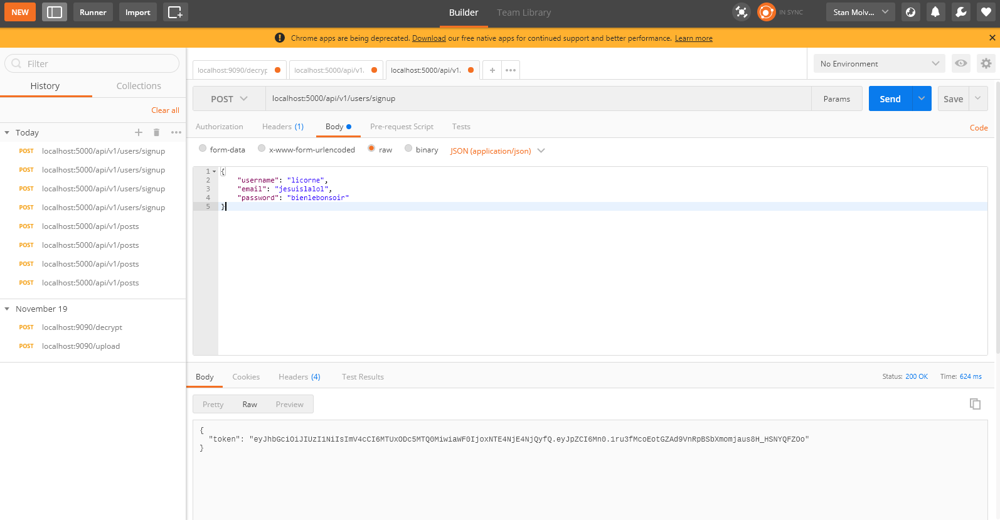

9Gag like API Rest in Python using Flask
===================
This 9gag like API is composed of users, posts, comments on posts, upvotes on posts, and upvotes on comments.
A user has to be registered to interact with posts and comments, or to create one.

## How to use it

**I did these tests on a Linux shell :**

The aim is to launch app.py which is our server.

*We will create a virtual environment to work in (install dependencies only in the venv).*

- First, cd in the folder FlaskTuto
- Launch these commands to create virtual env and install dependencies (you need python3 and pip3 installed)

	- pip3 install virtualenv
	- virtualenv venv -p python3
	- source venv/bin/activate

**The virtual environment is now up**

----------

Then we install the dependencies which are "stored" in requirements

	- pip3 install -r requirements
	- pip3 freeze > requirements

#### Then we launch the server

- python3 app.py

The serveur is now up on localhost port 5000.

----------

We can use **Postman** to test it, or a script i wrote called **global_test.py** to test the different cases we can encounter.

The script is located in the "test" folder.

### Postman Example

By Postman we will create a user.

**Do as this image :**

You need to set the option on **"POST"**, and enter the path **localhost:5000/api/v1/users/signup**.

Then we write a JSON query in the body -> raw and change the option to JSON.

And create a user like : 

`{
	"username": "licorne",
	"email": "jesuislalol",
	"password": "bienlebonsoir"
}`

That's it, you registered a user in the local database, you can now take the token to use it.

### Global_test.py
This script test different cases of signup, GET or POST on comment/posts/upvotes ..
To launch it:

	- Open a new terminal
	- cd in the folder /test
	- launch the command python3 global_test.py

